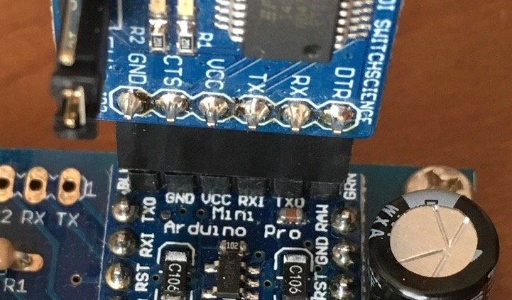
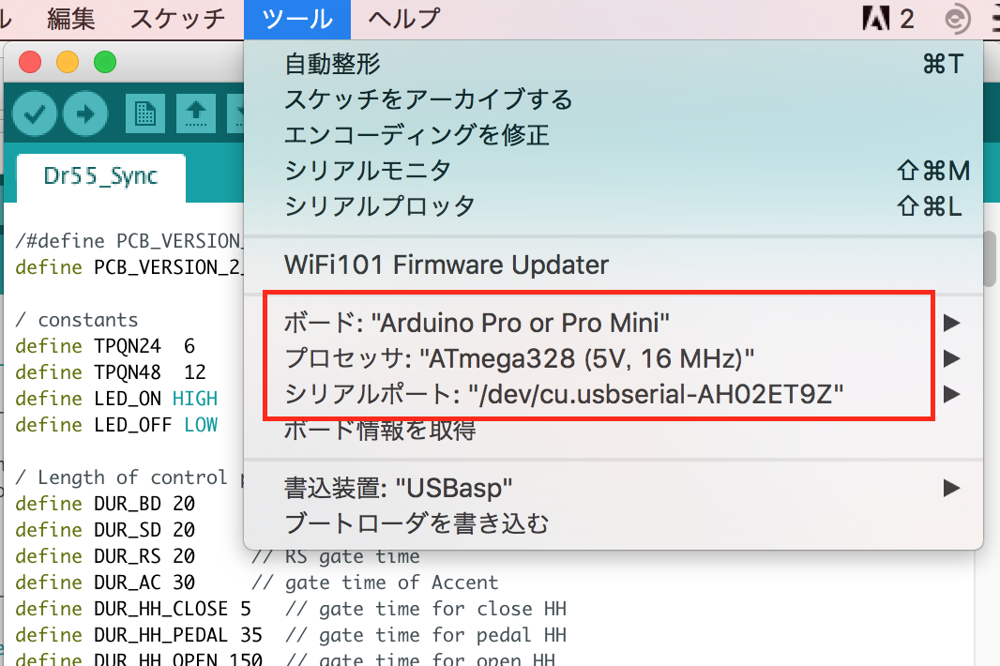
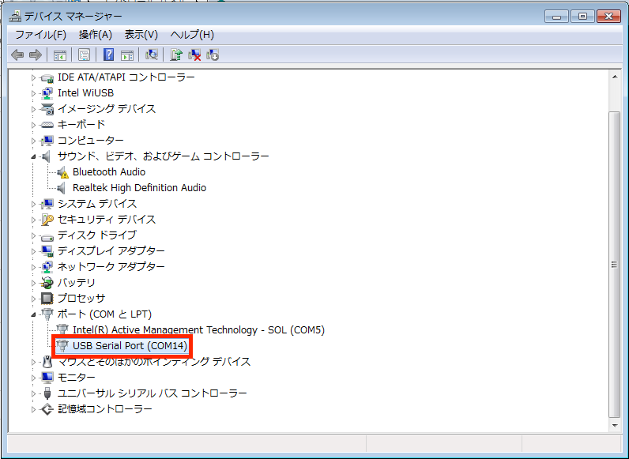
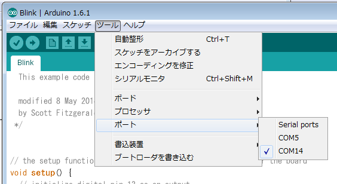

## プログラムの書き換え

DR-55 MIDI Sync Boardは、マイコンにArduinoを使用しています。Arduinoの開発環境を使って、プログラムを変更することが可能です。

ここでは、変更の手順を説明します。

### 用意するもの

+ PC (Windows/Mac)
+ USBシリアル変換アダプタ　例：[SwitchScience社製変換アダプタ](https://www.switch-science.com/catalog/1032/)
+ USBケーブル（PCと変換アダプタを接続）

### ソフトウェアの準備

1. PCに、Arduino IDE 開発環境をインストールします。
[ここ](https://www.arduino.cc/en/Main/Software)から、ダウンロードします。
2. 変換アダプタ用USBドライバーをインストールします。
上記アダプタの場合、[FTDI社のドライバ](http://www.ftdichip.com/Drivers/VCP.htm)をダウンロードして、インストールします。それ以外のアダプタは、変換アダプタの説明書を参照するか、販売元に確認してください。
3. Metro ライブラリをインストールします。
[ここ](https://github.com/thomasfredericks/Metro-Arduino-Wiring/archive/master.zip)をクリックして、Metroライブラリをダウンロードします。ダウンロードされたzipファイルを解凍すると、解凍フォルダの中に”Metro”というフォルダが現れます。この”Metro”フォルダを、以下のフォルダの中に置きます。
|PC|フォルダ|
------|------ 
|Macの場合|書類/Arduino/libraries|
|Windowsの場合|ライブラリ/ドキュメント/Arduino/libraries|
4. Arduino IDEが立ち上がっている場合は、再起動します。

### プログラム変更

1. DR-55 MIDI Sync Boardのソースファイルを、[ダウンロード](https://raw.githubusercontent.com/dwt98/dr55sync/master/Dr55_Sync.ino)
します。
2. ソースファイルをArduino IDEでオープンし、ソースを変更します。
3. ソースを変更したら、「検証」ボタン（左上のチェックマーク）をクリック。エラーがでないことを確認。

### プログラムの書き込み

1. DR-55からSync Boardを外すか、DR-55の電源が切れていることを確認。
2. 変換アダプタに、電圧切り替え（5V/3.3V）がある場合は、5Vに設定する。
3. 変換アダプタをArduinoのピンヘッダーにつなぐ。向き（表裏）に注意。記載されている信号名が一致しない場合があるが、送信(TX), 受信(RX)が相互に接続されて、電源(VCC)ピンが合っていれば大体動く。

4. 変換アダプタをUSBケーブルでPCにつなぐ。Windowsで初めての接続の場合は、USBドライバのインストールが始まる時がある。Arduinoに電源が供給されるので、赤いLEDが点く。
5. Arduino IDEで、以下の設定をする。
6. [ツール]メニュー - [ボード] - [Arduino Pro or Pro Mini] を選択。
7. [ツール]メニュー - [プロセッサ] - [ATmega328 (5V, 16MHz)] を選択。
8. シリアルポートを選びます。  

**Macの場合**  

[ツール]メニュー - [シリアルポート] - [/dev/cu.usbserial-XXXXX]を選択。(XXXXは何かの文字が入ります）変換アダプタによって名前が異なることがある。
  

**Windowsの場合**  

デバイスマネージャーでUSBシリアルポートの名前を調べます。下のサンプルでは、COM14という名前だとわかります。

Arduino IDEの[ツール]メニュー- [ポート]で、COM14を選択します。

9. DR-55 ボードのDIPスイッチの１番をPGMに設定。
10. Arduino IDEで、「マイコンボードに書き込む」(検証ボタンの隣の右矢印ボタン）をクリックして、書き込み。
11. 「ボードへの書き込みが完了しました」と表示されれば転送終了。
12. Arduinoのリセットボタンを押して、LEDが4回つけばOK。
13. DIPスイッチをMIDIに戻し、DR-55の電源を入れて動作確認する。
14. 問題なければ、変換アダプタを取り外して、作業終了です。

### トラブルシューティング

*手順8で、それっぽいポート名が表示されない。*
+ USBケーブルを一旦抜いて、しばらく待ってから挿し直す。
+ PCを再起動する。
+ 表示されているポートを、とりあえず順番に試す。
+ USBドライバを再インストールする。変換アダプタの型番＋”ドライバ”で、ネット検索すると、対処法などの情報が見つかることがあります。

*手順11でエラーが表示される。*
+ DR-55のDIPスイッチがPGMになっているか確認。
+ USBケーブルがデータ通信対応のものか。充電用のUSBケーブルは使えません。
+ 変換アダプタがピンヘッダに奥まで差し込まれているか、向きは合っているか。
+ Arduinoのresetボタンを押してから、転送する。
+ Arduino IDEで、ボード、プロセッサ、ポートの設定を確認する。
+ 変換アダプタに送信、受信のLEDがあり、転送中は高速に点滅するはず。点滅しないか、点滅してもすぐ止まる場合は、通信に失敗しているので、上記設定を再度確認する。

